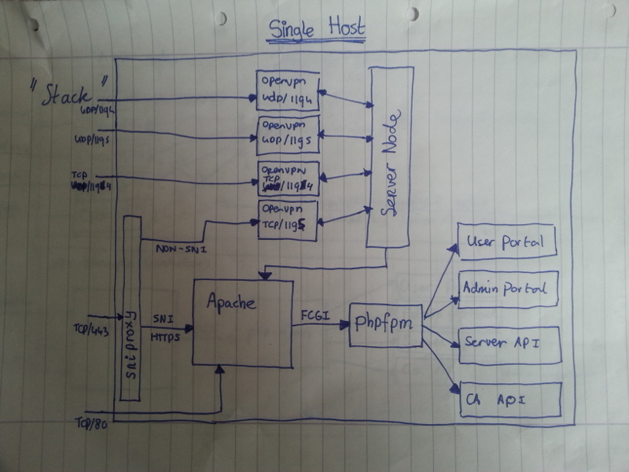
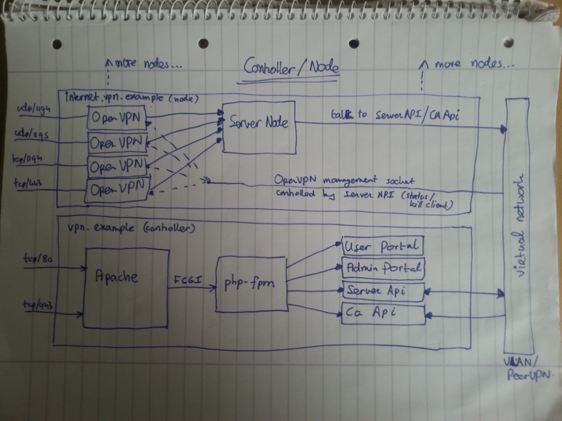

# Architecture

This document describes the architecture of the software, its components and
how it interacts.

# Single Host

This image describes the "default" configuration of the software using the 
`deploy.sh` script found in this repository. It describes a system where 
everything runs on one (virtual) machine with one IP adddress.

## SNI Proxy

[sniproxy](https://github.com/dlundquist/sniproxy) is used to share `TCP/443` 
between Apache and the OpenVPN TCP instance. This is to avoid broken networks
or network filters where UDP connections are blocked or broken.

## Apache

[Apache](https://httpd.apache.org/) binds the software together. Both the user 
visible components (User Portal and Admin Portal), as well as the internal 
services (Server API and CA API) are all 
[routed through Apache](resources/vpn.example.conf). The communication between 
the components is also done through Apache. This makes it possible to separate 
the components in different containers, VMs or even physical machines.

## PHP FPM

The software is written in PHP and behind the PHP 
[FastCGI Process Manager](https://secure.php.net/manual/en/install.fpm.php). 
This increases the performance and does not require `mod_php` running in 
Apache.

## OpenVPN

The [OpenVPN](https://openvpn.net) processes run using configurations 
generated by Server API. By default they listen on `UDP/1194`, `UDP/1195`, 
`TCP/1194` and `TCP/1195`. The `TCP/1195` instance is connected to by SNI Proxy
to allow OpenVPN clients to connect over `TCP/443`.

## User Portal

The [User Portal](https://github.com/eduvpn/vpn-user-portal) allows end users 
using a web browser to create configurations, i.e. certificates, enroll for 
two-factor authentication and disable their certificates when losing a device. 

In addition to using a web browser to access the portal, an OAuth 2.0 protected
API is also available. This can e.g. be used by applications running on a 
device to obtain a configuration without requiring the user to manually 
download and install OpenVPN configurations.

The User Portal interacts with the Server API and CA API.

## Admin Portal

The [Admin Portal](https://github.com/eduvpn/vpn-admin-portal) allows 
administrators using a web browser to manage user's configurations 
(certificates). It also has to option to disable (and re-enable) certificates, 
throw away user's two-factor secret, and completely block and unblock users. It 
can also be used to view currently connected clients, get an overview of the 
usage (stats) and search the connection logs.

The Admin Portal interacts with the Server API and CA API.

## CA API

The [CA API](https://github.com/eduvpn/vpn-ca-api) is responsible for 
everything related to certificates. It can be used to generate user 
certificates and server certificates.

## Server API

The [Server API](https://github.com/eduvpn/vpn-server-api) is responsible for 
storing the list of disabled users and certificates, the two-factor secrets of
the users and the group membership information.

## Server Node

The [Server Node](https://github.com/eduvpn/vpn-server-node) is responsible for 
configuring the OpenVPN instances and handle client connections.

# Controller/Node

This image describes the distributed configuration of the software using the 
`deploy_controller.sh` and `deploy_node.sh` script found in this repository. It
separates the controller (User Portal, Admin Portal, Server API and CA API) 
from the OpenVPN instance (Server Node).

Here we do not need SNI Proxy as the nodes can directly claim `TCP/443` as 
there is no web server listening on server nodes.

The controller and nodes communicate with each other over a virtual network,
this can either be a private VLAN between the hosts, or 
[PeerVPN](https://peervpn.net) or basically any other (virtual) networking 
system. PeerVPN is configured with the `deploy_controller.sh` and 
`deploy_node.sh` scripts.
